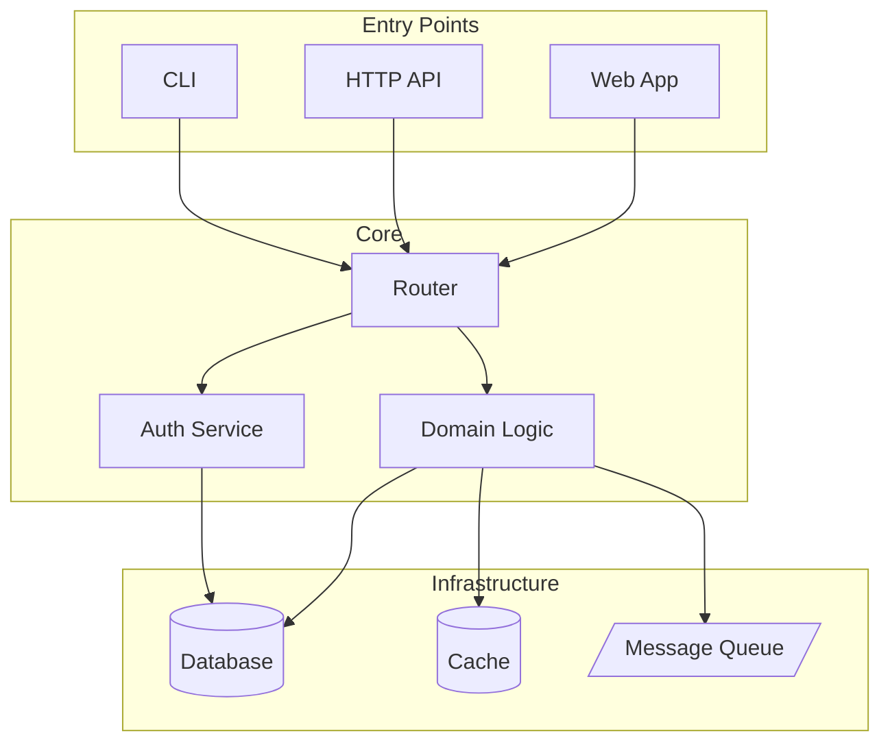
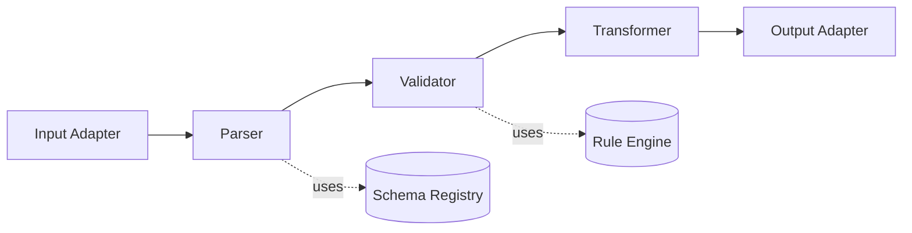
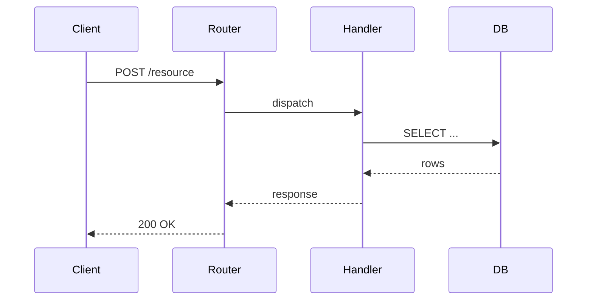
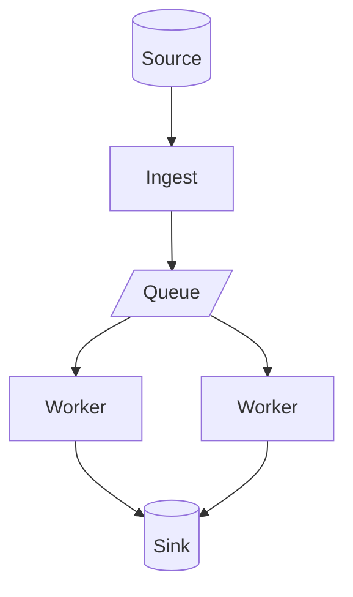
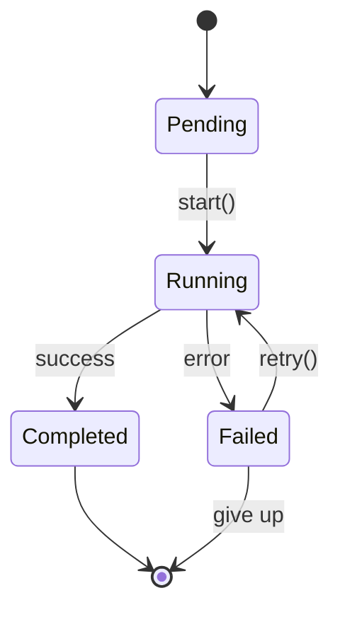

# Mermaid Diagram Patterns

Four diagram types cover ~95% of what a codebase wiki needs. Use the first one that fits; skip a diagram rather than force-fit a pattern.

GitHub renders Mermaid natively inside ```` ```mermaid ```` fences, so no extra tooling is required.

---

## §1 — High-Level Architecture (Overview page)

**When:** Always on the Overview page. Shows the major subsystems and their primary relationships.

**Pattern:** Top-down boxes grouped by tier (entry → core → infrastructure).



**Rules:**

- Use `subgraph` to group related nodes; name groups by role, not folder
- Use shapes to encode kind: `[]` service, `(())` external, `[()]` database, `[/.../]` queue/topic
- 5–12 nodes is the sweet spot; more becomes unreadable

---

## §2 — Component / Module Architecture (Category page)

**When:** On each subsystem page that has 3+ collaborating modules.

**Pattern:** Left-to-right flowchart showing modules inside the subsystem.



**Rules:**

- Solid arrows = data/control flow; dashed `-.label.->` = dependency/reference
- Keep to modules *within* the subsystem; external dependencies hang off as side nodes
- Label arrows only when the relationship isn't obvious from node names

---

## §3 — Data / Request Flow (Category page, optional)

**When:** The subsystem has a clear request lifecycle, event flow, or pipeline.

**Pattern:** Sequence diagram for request/response; flowchart for batch pipelines.

### Sequence (synchronous request/response)



### Flowchart (async / batch pipeline)



**Rules:**

- Pick *one* — don't show both for the same flow
- 4–7 participants/steps; collapse trivial intermediaries
- Self-arrows (`A->>A`) are fine for internal state changes but use sparingly

---

## §4 — State Machine (Detail page, optional)

**When:** A component manages explicit state transitions (workflow, lifecycle, FSM).



**Rules:**

- Label transitions with the triggering event or method
- Use `[*]` for initial/terminal states
- Keep to ≤8 states; nested composite states usually mean the diagram is doing too much

---

## When to skip the diagram

Skip rather than force it when:

- **The subsystem is a flat utility module.** A diagram of "five unrelated helper functions" tells the reader nothing.
- **The structure isn't clear from the code.** Don't reverse-engineer a fictional architecture.
- **Two pages would show the same diagram.** Put it on the parent page and link.
- **The diagram would have >15 nodes.** Either group with subgraphs or split into two diagrams.

A page with no diagram is fine. A page with a misleading diagram is worse than a page with none.

---

## Style conventions

- One diagram per H2 section maximum.
- Diagram immediately follows the section heading; explanatory prose follows the diagram.
- Always include a 1–2 sentence prose explanation under the diagram. Don't make the reader interpret it alone.
- Don't put citations *inside* diagrams (Mermaid doesn't render them as links). Cite the relevant files in the section's `Sources:` footer.
- Use the project's actual identifier names in diagram node labels — not invented capitalizations. If the class is `httpRouter`, label the node `httpRouter`, not `HTTP Router`.
